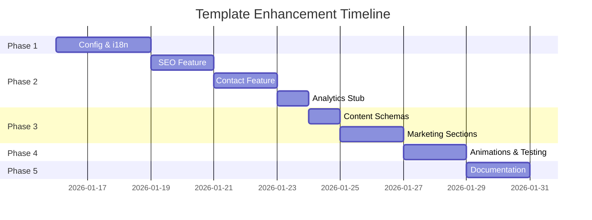

# Template Enhancement: Phased Implementation Plan

A structured roadmap for implementing template improvements while maintaining stability and reusability.

---

## Phase Overview

| Phase | Focus | Duration | Risk |
|-------|-------|----------|------|
| **1** | Foundation & Config | 2-3 days | Low |
| **2** | Core Features | 3-4 days | Medium |
| **3** | Marketing Sections | 2-3 days | Low |
| **4** | Polish & DX | 2 days | Low |
| **5** | Documentation | 1-2 days | Low |

---

## Phase 1: Foundation & Configuration

**Goal:** Complete empty placeholder files and establish config patterns.

### 1.1 Site Configuration
- [ ] Implement `src/config/site.ts`
- [ ] Implement `src/config/seo.ts`
- [ ] Create `src/config/features.ts` (feature flags)

### 1.2 i18n Setup
- [ ] Implement `src/lib/intl.ts` (request config)
- [ ] Add `src/hooks/use-direction.ts`
- [ ] Add RTL styles in `globals.css`

### 1.3 Layout Structure
- [ ] Implement `src/app/[locale]/layout.tsx`
- [ ] Create `(marketing)/layout.tsx`
- [ ] Create `(legal)/layout.tsx`

### 1.4 Environment Setup
- [ ] Create `.env.example`
- [ ] Implement `src/lib/env.ts` (Zod validation)

**Deliverables:**
- Working configuration system
- i18n fully functional
- Route groups with layouts

---

## Phase 2: Core Features (Bulletproof React)

**Goal:** Implement essential features with proper isolation.

### 2.1 SEO Feature
```
src/features/seo/
├── components/
│   ├── JsonLd.tsx
│   └── MetaTags.tsx
├── config.ts
└── index.ts
```
- [ ] Create SEO config schema
- [ ] Implement JSON-LD components
- [ ] Add `src/app/sitemap.ts`
- [ ] Add `src/app/robots.ts`

### 2.2 Contact Feature
```
src/features/contact/
├── components/
│   ├── ContactForm.tsx
│   └── FormField.tsx
├── schemas.ts
├── api.ts
└── index.ts
```
- [ ] Create form schema (Zod)
- [ ] Implement form components
- [ ] Add API route stub
- [ ] Add translations (en/ar)

### 2.3 Analytics Feature (Stub)
```
src/features/analytics/
├── components/
│   ├── GoogleAnalytics.tsx
│   └── MetaPixel.tsx
├── lib/tracking.ts
└── index.ts
```
- [ ] Create GA4 component (lazy-loaded)
- [ ] Create Meta Pixel component
- [ ] Add tracking utilities
- [ ] Wire to feature flags

**Deliverables:**
- SEO infrastructure complete
- Contact form working
- Analytics ready to activate

---

## Phase 3: Marketing Sections

**Goal:** Create reusable, content-driven marketing components.

### 3.1 Content Schemas
```
src/features/marketing/content/
├── schemas.ts
├── home.ts
└── services.ts
```
- [ ] Define `HeroContent` schema
- [ ] Define `FeatureItem` schema
- [ ] Define `TestimonialItem` schema
- [ ] Define `CTAContent` schema

### 3.2 Section Components
```
src/features/marketing/components/
├── Hero.tsx
├── Features.tsx
├── Testimonials.tsx
├── CTA.tsx
└── index.ts
```
- [ ] Implement Hero (3 variants)
- [ ] Implement Features grid
- [ ] Implement Testimonials
- [ ] Implement CTA section

### 3.3 Translations
- [ ] Add `messages/en/marketing.json`
- [ ] Add `messages/ar/marketing.json`

**Deliverables:**
- 4+ marketing sections
- Content schema pattern established
- Full i18n support

---

## Phase 4: Polish & Developer Experience

**Goal:** Improve quality and maintainability.

### 4.1 Animation System
- [ ] Create `src/styles/animations.css`
- [ ] Add animation toggle in features config
- [ ] Document animation utilities

### 4.2 Testing Setup
- [ ] Add unit test config to vitest
- [ ] Create `src/testing/setup.ts`
- [ ] Create `src/testing/render.tsx`
- [ ] Add example tests

### 4.3 ESLint Configuration
- [ ] Add import restriction rules
- [ ] Configure Bulletproof React zones
- [ ] Add Husky + lint-staged

### 4.4 Scripts
- [ ] Add `type-check` script
- [ ] Add `analyze` script

**Deliverables:**
- Animation system opt-in
- Testing infrastructure
- Code quality enforcement

---

## Phase 5: Documentation

**Goal:** Make template self-documenting.

### 5.1 Core Docs
- [ ] Rewrite `README.md`
- [ ] Create `docs/getting-started.md`
- [ ] Create `docs/customization.md`

### 5.2 Feature Docs
- [ ] Create `docs/features.md`
- [ ] Create `docs/i18n.md`
- [ ] Create `docs/deployment.md`

### 5.3 Storybook
- [ ] Create stories for marketing sections
- [ ] Add component documentation
- [ ] Configure a11y testing

**Deliverables:**
- Complete documentation
- Storybook catalog
- Ready for client delivery

---

## Implementation Order



---

## Quick Wins (Do First)

1. **`config/features.ts`** - Enables opt-in pattern immediately
2. **`lib/env.ts`** - Validates environment on startup
3. **`app/sitemap.ts`** - Instant SEO improvement
4. **Marketing Hero** - Most reusable section

---

## Risk Mitigation

| Risk | Mitigation |
|------|------------|
| Breaking i18n | Test both locales after changes |
| Cross-feature coupling | ESLint rules in Phase 4 |
| Heavy dependencies | Review before adding any library |
| Unused features | Default all to `enabled: false` |

---

## Success Metrics

- [ ] All placeholder files have content
- [ ] 4+ marketing sections available
- [ ] Contact form functional
- [ ] SEO complete with JSON-LD
- [ ] Feature flags control all optional items
- [ ] Zero hardcoded copy in components
- [ ] Storybook shows all sections
- [ ] README updated with usage guide
